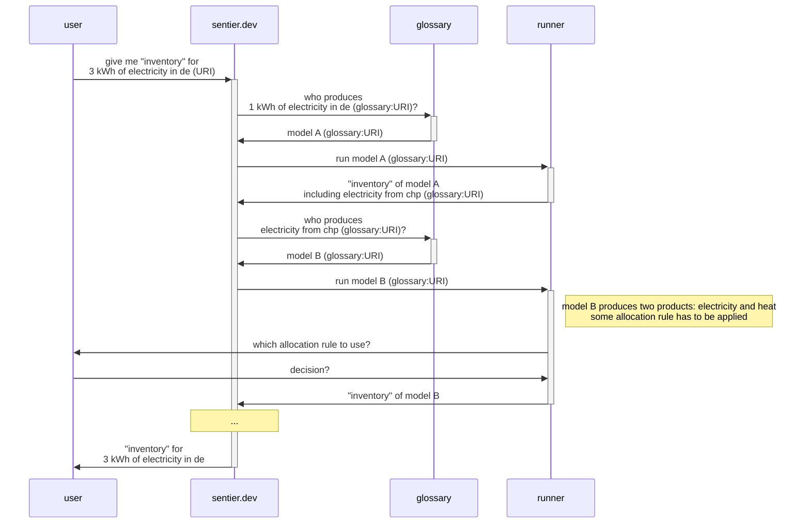

# moeschberg_example_models

### Sequence diagram for User Story 02

```mermaid
sequenceDiagram
user->>+sentier.dev: give me "inventory" for<br/>3 kWh of electricity in de (URI)
sentier.dev->>+glossary: who produces<br/>1 kWh of electricity in de (glossary:URI)?
glossary->>-sentier.dev: model A (glossary:URI)
sentier.dev->>+runner: run model A (glossary:URI)
runner->>-sentier.dev: "inventory" of model A<br/>including electricity from chp (glossary:URI)
sentier.dev->>+glossary: who produces<br/>electricity from chp (glossary:URI)?
glossary->>-sentier.dev: model B (glossary:URI)
sentier.dev->>+runner: run model B (glossary:URI)
note right of runner: model B produces two products: electricity and heat<br/>some allocation rule has to be applied
runner->>user: which allocation rule to use?
user->>runner: decision?
runner->>-sentier.dev: "inventory" of model B
note over sentier.dev: ...
sentier.dev->>-user: "inventory" for<br/>3 kWh of electricity in de
```

