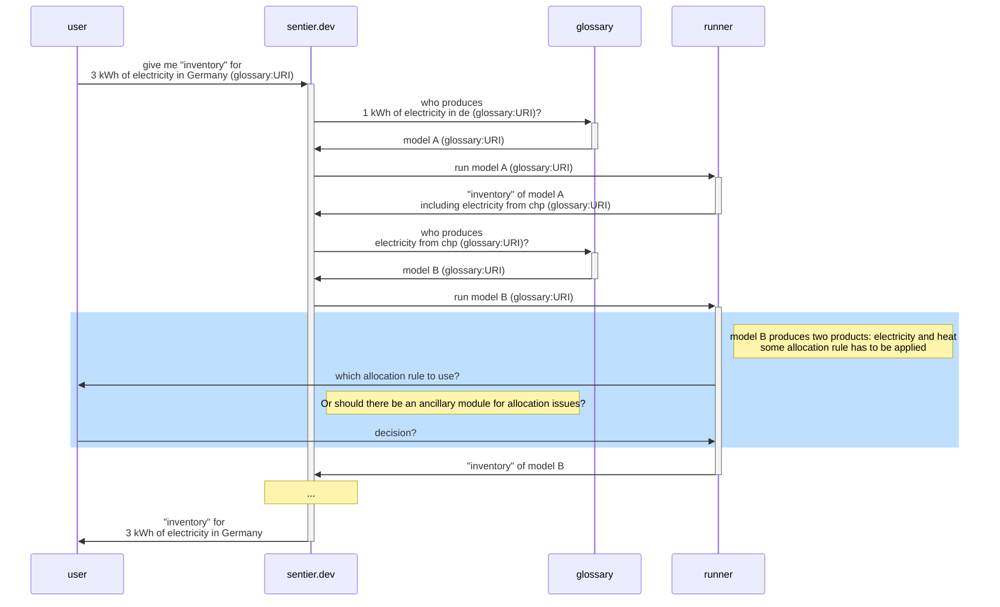
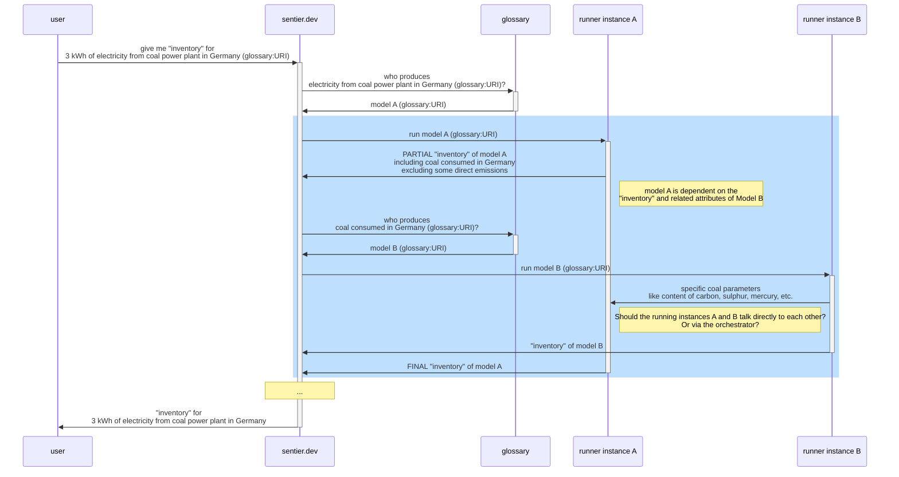

# moeschberg_example_models

## User stories

As [a persona], I want to [ ], so that [ ].

| id | As                                                  | I want to                | so that                                                                                                                                                                                    |   |
|----|-----------------------------------------------------|--------------------------|--------------------------------------------------------------------------------------------------------------------------------------------------------------------------------------------|---|
| 01 | user of the model                                   | be able to run the model | so that I get a calculated inventory or set of calculated parameters out of the model                                                                                                      |   |
| 02 | user of the model                                   | be informed              | if some hidden allocation rule is being applied in the background for a more-than-one-output-process-model (e.g. how to allocate the "inventory" of a combined heat and power plant towards its co-products heat and electricity)                                                                                | [sequence diagram](#user-story-02)   |
| 03 | model developer                                     | store a model            | I can reuse it in the future                                                                                                                                                               |   |
| 04 | model developer                                     | store a model            | I can share it with others                                                                                                                                                                 |   |
| 05 | model developer from industry                       | store a model            | so that the model can be used to run, but cannot be decompiled, or intellectual property used within the model to be disclosed (note difference from academia/open source model developer) |   |
| 06 | model developer from academia/open source community | store a model            | so that the model can be opened and inspected (note difference from industry model developer)                                                                                              |   |
| 07 | model developer | provide a model with dependencies on other "supply" model | the model produces different results depending on its supply chain (e.g. coal power plant emissions depend on where the coal has come from) | [sequence diagram](#user-story-07) |

### Sequence diagrams

#### User Story 02

#### User Story 07

## Design choices
Try and match terms for processes to the latest version (at the time of writing) [European Commission Common Nomenclature ontology](https://showvoc.op.europa.eu/#/datasets/ESTAT_Combined_Nomenclature,_2024_%28CN_2024%29/data)

# Sources / References
- [LCA_WIND_DK](https://github.com/romainsacchi/LCA_WIND_DK) a model of wind turbines in Denmark which gives the material inputs required (concrete, steel, fibreglass, etc)
- [windsch](https://github.com/romainsacchi/windisch) a model for the calculation of the masses of components (the nacelle, foundation, blades, etc) of a wind turbine given its power rating. 
- [European Commission Common Nomenclature 2024](https://showvoc.op.europa.eu/#/datasets/ESTAT_Combined_Nomenclature,_2024_%28CN_2024%29/data) an ontology for processes

